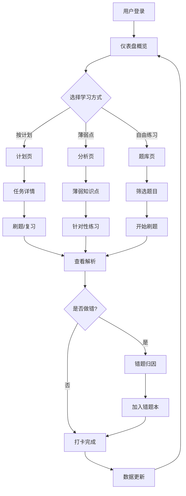

## 1. 产品概述

法考智学是一款面向国家统一法律职业资格考试考生的学习备考Web应用，通过科学化的题目训练管理和复习节奏控制，帮助考生高效备考。

- **核心目标**：解决法考考生刷题效率低、复习无计划、薄弱点不清晰等痛点，提供从题目练习到模考分析的一站式备考解决方案
- **目标用户**：法考备考考生（包括在校学生、在职考生等）
- **市场价值**：填补法考领域"智能化+个性化"备考工具的空白，通过数据驱动提升备考效率

## 2. 核心功能

### 2.1 用户角色

| 角色 | 注册方式 | 核心权限 |
|------|----------|----------|
| 普通考生 | 账号注册/游客登录 | 使用全部备考功能、查看个人数据、管理学习计划 |

### 2.2 功能模块

1. **仪表盘**：学习概览、今日任务、进度统计、复习提醒
2. **题库**：科目筛选、章节练习、题目搜索、收藏管理
3. **刷题**：随机组卷、计时答题、答案解析、错题归因
4. **错题本**：错题归类、薄弱点统计、错题重练、归因分析
5. **计划**：每日计划、进度打卡、复习提醒、任务管理
6. **笔记**：笔记关联、知识整理、标签管理、快速检索
7. **模考**：模拟考试、计时评分、模考排名、主观题评分
8. **分析**：成绩趋势、知识点热力图、薄弱点分析、能力雷达

### 2.3 页面详情

| 页面名称 | 模块名称 | 功能描述 |
|----------|----------|----------|
| 仪表盘 | 数据概览 | 展示累计刷题数、正确率、学习天数等核心数据卡片 |
| 仪表盘 | 今日任务 | 显示今日待完成的刷题、复习、笔记任务 |
| 仪表盘 | 复习提醒 | 基于艾宾浩斯遗忘曲线的智能复习提醒 |
| 仪表盘 | 进度可视化 | 环形进度图、柱状图展示各科目学习进度 |
| 题库 | 科目筛选 | 按民法、刑法、行政法等8大法考科目筛选 |
| 题库 | 章节导航 | 树状结构展示各科目章节，支持章节练习 |
| 题库 | 题目搜索 | 支持关键词搜索题目、知识点 |
| 题库 | 收藏管理 | 收藏重点题目，建立个人重点题库 |
| 刷题 | 随机组卷 | 按科目/章节/难度随机组卷练习 |
| 刷题 | 计时答题 | 单题计时、整卷计时两种模式 |
| 刷题 | 答案解析 | 提交后显示正确答案、详细解析、关联法条 |
| 刷题 | 错题归因 | 标记错误原因（概念不清/法条不熟/审题失误等） |
| 错题本 | 错题列表 | 按时间/科目/错误类型分类展示错题 |
| 错题本 | 薄弱点统计 | 自动统计高频错误知识点 |
| 错题本 | 错题重练 | 支持重新练习错题，清除已掌握错题 |
| 错题本 | 归因分析 | 饼图展示各类错误原因占比 |
| 计划 | 每日计划 | 创建每日刷题、复习、背诵任务 |
| 计划 | 进度打卡 | 完成任务后打卡，连续打卡激励 |
| 计划 | 智能推荐 | 根据薄弱点推荐练习内容 |
| 计划 | 复习日历 | 日历视图展示每日学习完成情况 |
| 笔记 | 笔记列表 | 支持富文本笔记，关联题目和知识点 |
| 笔记 | 标签管理 | 自定义标签分类整理笔记 |
| 笔记 | 快速检索 | 全文搜索笔记内容 |
| 笔记 | 题目关联 | 在刷题时可直接添加笔记关联到题目 |
| 模考 | 模拟考试 | 按真实法考时间和题量组织模考 |
| 模考 | 计时评分 | 客观题自动评分，主观题支持人工评分记录 |
| 模考 | 模考排名 | 查看本次模考在所有用户中的排名 |
| 模考 | 成绩记录 | 保存历次模考成绩，支持复盘 |
| 分析 | 成绩趋势 | 折线图展示刷题正确率和模考成绩变化趋势 |
| 分析 | 知识点热力图 | 按科目章节展示知识点掌握程度热力图 |
| 分析 | 薄弱点分析 | 智能识别薄弱知识点，推荐补题 |
| 分析 | 能力雷达图 | 多维度展示各科目能力水平 |

## 3. 核心流程

### 3.1 主要用户流程

1. **每日学习流程**：用户登录 → 仪表盘查看今日任务 → 进入刷题模式 → 完成题目 → 查看解析并标记错题 → 关联笔记 → 打卡完成任务 → 分析页查看数据

2. **薄弱点补题流程**：分析页查看薄弱知识点 → 点击薄弱点 → 跳转题库筛选对应知识点题目 → 针对性练习 → 重练错题直至掌握

3. **计划驱动学习流程**：创建每日学习计划 → 系统根据计划推送任务 → 进入练习 → 完成后打卡 → 计划页展示完成进度

### 3.2 流程图

## 4. 用户界面设计

### 4.1 设计风格

- **主色调**：深靛蓝 (#1E3A8A) - 代表法律的庄重与专业
- **辅助色**：金橙色 (#F59E0B) - 用于强调重点、提醒、进度标记
- **成功色**：翡翠绿 (#10B981) - 正确答案、完成状态
- **错误色**：玫瑰红 (#F43F5E) - 错误答案、警示提醒
- **中性色**：石板灰系列 - 文字、背景、边框

- **按钮风格**：圆角8px，悬停微上浮效果，渐变背景
- **字体选择**：
  - 标题字体："Noto Serif SC" - 宋体衬线，体现法律文书的正式感
  - 正文字体："Noto Sans SC" - 无衬线，保证阅读舒适度
- **布局风格**：卡片式布局，左侧导航栏 + 顶部标题栏 + 主内容区
- **图标风格**：线性图标搭配轻微填充，统一16px/20px尺寸

### 4.2 页面设计概述

| 页面名称 | 模块名称 | UI元素 |
|----------|----------|--------|
| 仪表盘 | 数据卡片 | 渐变背景、数字动画、图标装饰 |
| 仪表盘 | 进度图表 | 环形进度条、柱状图、平滑动画 |
| 题库 | 科目筛选 | 标签式切换、图标区分科目 |
| 题库 | 章节树 | 可折叠树状结构、进度标记 |
| 刷题 | 答题区 | 大字号题目、选项卡片、计时器 |
| 刷题 | 解析区 | 折叠面板、法条引用高亮 |
| 错题本 | 归因分析 | 饼图、错误类型标签 |
| 计划 | 日历视图 | 打卡标记、任务数量角标 |
| 模考 | 考试界面 | 全屏模式、倒计时、进度条 |
| 分析 | 热力图 | 颜色深浅表示掌握程度、可交互 |

### 4.3 响应式设计

- **桌面优先**：1440px基准设计，最小支持1280px
- **平板适配**：768px-1024px，导航栏可折叠，两列布局
- **移动适配**：375px-768px，底部Tab导航，单列布局，触摸优化间距
- **触摸优化**：最小点击区域44px，滑动手势支持

### 4.4 动效设计

- **页面加载**：卡片交错淡入（staggered fade-in），延迟50ms递增
- **数据更新**：数字滚动动画，进度条平滑过渡
- **答题交互**：选项选中缩放反馈，正确/错误答案颜色渐变
- **导航切换**：内容区滑动过渡，左侧导航高亮条平滑移动
- **悬停效果**：卡片微上浮（translateY(-2px)），阴影加深
