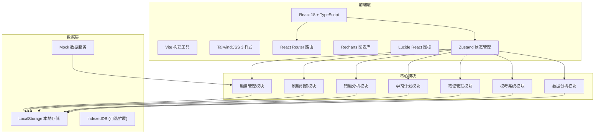
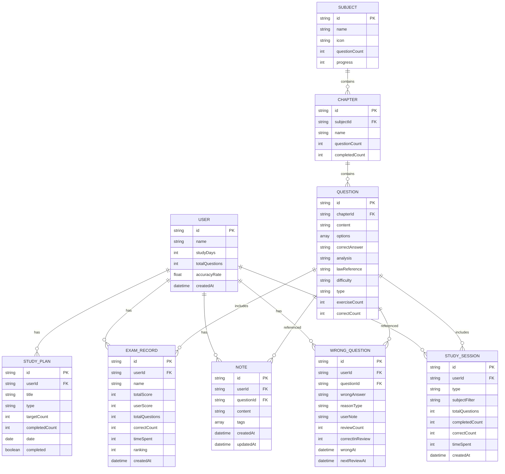

## 1. 架构设计



## 2. 技术描述

- **前端框架**: React@18.2 + TypeScript@5
- **构建工具**: Vite@5
- **样式方案**: TailwindCSS@3.4 + PostCSS
- **路由管理**: React Router@6
- **状态管理**: Zustand@4
- **图表库**: Recharts@2
- **图标库**: Lucide React@0.3
- **数据持久化**: LocalStorage + 内存Mock数据
- **代码规范**: ESLint + Prettier

## 3. 路由定义

| 路由路径 | 页面组件 | 功能说明 |
|----------|----------|----------|
| `/` | DashboardPage | 仪表盘首页 |
| `/question-bank` | QuestionBankPage | 题库页面 |
| `/practice` | PracticePage | 刷题页面 |
| `/practice/:sessionId` | PracticePage | 特定刷题会话 |
| `/wrong-questions` | WrongQuestionsPage | 错题本页面 |
| `/plan` | PlanPage | 学习计划页面 |
| `/notes` | NotesPage | 笔记管理页面 |
| `/exam` | ExamPage | 模考列表页面 |
| `/exam/:examId` | ExamSessionPage | 模考进行中页面 |
| `/exam/:examId/result` | ExamResultPage | 模考结果页面 |
| `/analysis` | AnalysisPage | 数据分析页面 |

## 4. 数据模型

### 4.1 数据模型定义



### 4.2 Mock 数据结构

#### 4.2.1 科目数据

```typescript
interface Subject {
  id: string;
  name: string;
  icon: string;
  color: string;
  totalQuestions: number;
  completedQuestions: number;
  accuracyRate: number;
}
```

#### 4.2.2 题目数据

```typescript
interface Question {
  id: string;
  subjectId: string;
  chapterId: string;
  type: 'single' | 'multiple' | 'subjective';
  difficulty: 'easy' | 'medium' | 'hard';
  content: string;
  options?: Array<{ label: string; text: string }>;
  correctAnswer: string;
  analysis: string;
  lawReference: string;
  isFavorite: boolean;
  exerciseCount: number;
  correctCount: number;
}
```

#### 4.2.3 刷题记录

```typescript
interface PracticeRecord {
  questionId: string;
  userAnswer: string;
  isCorrect: boolean;
  timeSpent: number;
  reasonType?: string;
  completedAt: Date;
}
```

#### 4.2.4 学习计划

```typescript
interface StudyPlanTask {
  id: string;
  title: string;
  type: 'practice' | 'review' | 'note';
  targetCount: number;
  completedCount: number;
  relatedSubject?: string;
  date: string;
  completed: boolean;
}
```

#### 4.2.5 笔记数据

```typescript
interface Note {
  id: string;
  questionId?: string;
  content: string;
  tags: string[];
  createdAt: Date;
  updatedAt: Date;
}
```

#### 4.2.6 模考记录

```typescript
interface ExamRecord {
  id: string;
  name: string;
  type: 'objective' | 'subjective' | 'full';
  totalQuestions: number;
  correctCount: number;
  totalScore: number;
  userScore: number;
  timeSpent: number;
  ranking?: number;
  totalParticipants?: number;
  subjectiveScores?: Array<{ questionId: string; score: number; maxScore: number }>;
  createdAt: Date;
}
```

## 5. 状态管理设计

### 5.1 用户状态 Store

```typescript
interface UserState {
  profile: {
    name: string;
    studyDays: number;
    currentStreak: number;
    totalQuestions: number;
    accuracyRate: number;
  };
  todayTasks: StudyPlanTask[];
  updateProfile: (data: Partial<UserState['profile']>) => void;
  completeTask: (taskId: string) => void;
}
```

### 5.2 题库状态 Store

```typescript
interface QuestionBankState {
  subjects: Subject[];
  chapters: Chapter[];
  questions: Question[];
  currentSubject: string | null;
  currentChapter: string | null;
  searchKeyword: string;
  setSubject: (id: string | null) => void;
  setChapter: (id: string | null) => void;
  setSearchKeyword: (keyword: string) => void;
  toggleFavorite: (questionId: string) => void;
}
```

### 5.3 刷题状态 Store

```typescript
interface PracticeState {
  isActive: boolean;
  sessionId: string | null;
  currentQuestionIndex: number;
  questions: Question[];
  answers: Map<string, string>;
  timeSpentPerQuestion: Map<string, number>;
  startTime: Date | null;
  startSession: (questions: Question[], mode: 'practice' | 'wrong' | 'exam') => void;
  submitAnswer: (questionId: string, answer: string) => void;
  nextQuestion: () => void;
  prevQuestion: () => void;
  finishSession: () => PracticeResult;
}
```

### 5.4 错题状态 Store

```typescript
interface WrongQuestionState {
  wrongQuestions: WrongQuestion[];
  reasonTypes: string[];
  addWrongQuestion: (questionId: string, wrongAnswer: string, reasonType: string) => void;
  updateReason: (id: string, reasonType: string) => void;
  markAsReviewed: (id: string, correct: boolean) => void;
  getWeakPoints: () => WeakPoint[];
}
```

### 5.5 笔记状态 Store

```typescript
interface NoteState {
  notes: Note[];
  tags: string[];
  addNote: (note: Omit<Note, 'id' | 'createdAt' | 'updatedAt'>) => void;
  updateNote: (id: string, content: string) => void;
  deleteNote: (id: string) => void;
  addTag: (tag: string) => void;
}
```

### 5.6 数据分析 Store

```typescript
interface AnalysisState {
  dailyStats: Array<{ date: string; questionCount: number; accuracyRate: number }>;
  subjectAccuracy: Array<{ subject: string; accuracyRate: number }>;
  weakPoints: Array<{ knowledgePoint: string; wrongCount: number; totalCount: number }>;
  heatmapData: Array<{ chapter: string; masteryRate: number }>;
  examTrend: Array<{ date: string; score: number }>;
  radarData: Array<{ subject: string; score: number; fullMark: number }>;
}
```

## 6. 核心模块实现

### 6.1 刷题引擎

```typescript
class PracticeEngine {
  private questions: Question[];
  private currentIndex: number;
  private answers: Map<string, string>;
  private timer: QuestionTimer;

  constructor(questions: Question[], mode: PracticeMode) {
    this.questions = this.shuffleIfNeeded(questions, mode);
    this.currentIndex = 0;
    this.answers = new Map();
    this.timer = new QuestionTimer();
  }

  submitAnswer(answer: string): boolean {
    const question = this.questions[this.currentIndex];
    this.answers.set(question.id, answer);
    this.timer.stop(question.id);
    return answer === question.correctAnswer;
  }

  getCurrentQuestion(): Question {
    return this.questions[this.currentIndex];
  }

  getProgress(): { current: number; total: number } {
    return { current: this.currentIndex + 1, total: this.questions.length };
  }

  calculateResult(): PracticeResult {
    let correctCount = 0;
    const details: AnswerDetail[] = [];

    this.questions.forEach((q) => {
      const userAnswer = this.answers.get(q.id);
      const isCorrect = userAnswer === q.correctAnswer;
      if (isCorrect) correctCount++;
      details.push({
        questionId: q.id,
        userAnswer,
        isCorrect,
        timeSpent: this.timer.getTimeSpent(q.id),
      });
    });

    return {
      totalQuestions: this.questions.length,
      correctCount,
      accuracyRate: correctCount / this.questions.length,
      details,
    };
  }
}
```

### 6.2 艾宾浩斯复习提醒

```typescript
class SpacedRepetition {
  private intervals = [1, 2, 4, 7, 15, 30]; // days

  calculateNextReview(wrongQuestion: WrongQuestion): Date {
    const reviewCount = wrongQuestion.reviewCount;
    const correctInReview = wrongQuestion.correctInReview;
    
    // 根据复习表现调整间隔
    let intervalIndex = Math.min(reviewCount, this.intervals.length - 1);
    
    if (correctInReview >= 2) {
      intervalIndex = Math.min(intervalIndex + 1, this.intervals.length - 1);
    }
    
    const interval = this.intervals[intervalIndex];
    const nextReview = new Date();
    nextReview.setDate(nextReview.getDate() + interval);
    
    return nextReview;
  }

  getTodayReviews(wrongQuestions: WrongQuestion[]): WrongQuestion[] {
    const today = new Date();
    today.setHours(0, 0, 0, 0);
    
    return wrongQuestions.filter((wq) => {
      const nextReview = new Date(wq.nextReviewAt);
      nextReview.setHours(0, 0, 0, 0);
      return nextReview <= today;
    });
  }
}
```

### 6.3 薄弱点分析

```typescript
class WeakPointAnalyzer {
  analyze(wrongQuestions: WrongQuestion[], questions: Question[]): WeakPoint[] {
    const chapterStats = new Map<string, { wrongCount: number; totalCount: number }>();

    // 统计每个章节的错题情况
    wrongQuestions.forEach((wq) => {
      const question = questions.find((q) => q.id === wq.questionId);
      if (!question) return;

      const chapterId = question.chapterId;
      if (!chapterStats.has(chapterId)) {
        chapterStats.set(chapterId, { wrongCount: 0, totalCount: 0 });
      }
      
      const stats = chapterStats.get(chapterId)!;
      stats.wrongCount++;
    });

    // 统计每个章节的总做题数
    const chapterQuestionCount = questions.reduce((acc, q) => {
      acc[q.chapterId] = (acc[q.chapterId] || 0) + q.exerciseCount;
      return acc;
    }, {} as Record<string, number>);

    // 计算错误率并排序
    const weakPoints: WeakPoint[] = [];
    chapterStats.forEach((stats, chapterId) => {
      const totalCount = chapterQuestionCount[chapterId] || stats.wrongCount;
      const errorRate = stats.wrongCount / totalCount;
      
      if (errorRate > 0.3) { // 错误率超过30%视为薄弱点
        weakPoints.push({
          chapterId,
          errorRate,
          wrongCount: stats.wrongCount,
          totalCount,
          recommendation: this.generateRecommendation(errorRate),
        });
      }
    });

    return weakPoints.sort((a, b) => b.errorRate - a.errorRate);
  }

  private generateRecommendation(errorRate: number): string {
    if (errorRate > 0.6) return '急需加强，建议重新学习章节内容';
    if (errorRate > 0.4) return '需要重点练习，建议多做相关题目';
    return '有待提高，建议定期复习';
  }
}
```

## 7. 项目目录结构

```
src/
├── assets/              # 静态资源
├── components/          # 通用组件
│   ├── layout/         # 布局组件
│   ├── ui/             # UI基础组件
│   ├── charts/         # 图表组件
│   └── common/         # 通用业务组件
├── pages/              # 页面组件
│   ├── Dashboard/
│   ├── QuestionBank/
│   ├── Practice/
│   ├── WrongQuestions/
│   ├── Plan/
│   ├── Notes/
│   ├── Exam/
│   └── Analysis/
├── store/              # Zustand状态管理
├── types/              # TypeScript类型定义
├── utils/              # 工具函数
├── mock/               # Mock数据
├── hooks/              # 自定义Hooks
├── App.tsx
├── main.tsx
└── index.css
```

## 8. 性能优化策略

1. **路由懒加载**: 使用 React.lazy 和 Suspense 实现代码分割
2. **虚拟列表**: 题目列表使用虚拟滚动，支持大量数据渲染
3. **Memo优化**: 对图表组件、选项卡片等使用 React.memo
4. **防抖节流**: 搜索输入、计时器更新等场景使用防抖节流
5. **LocalStorage缓存**: 用户数据、刷题进度本地缓存
6. **懒加载图表**: 图表组件按需加载，提升首屏速度
